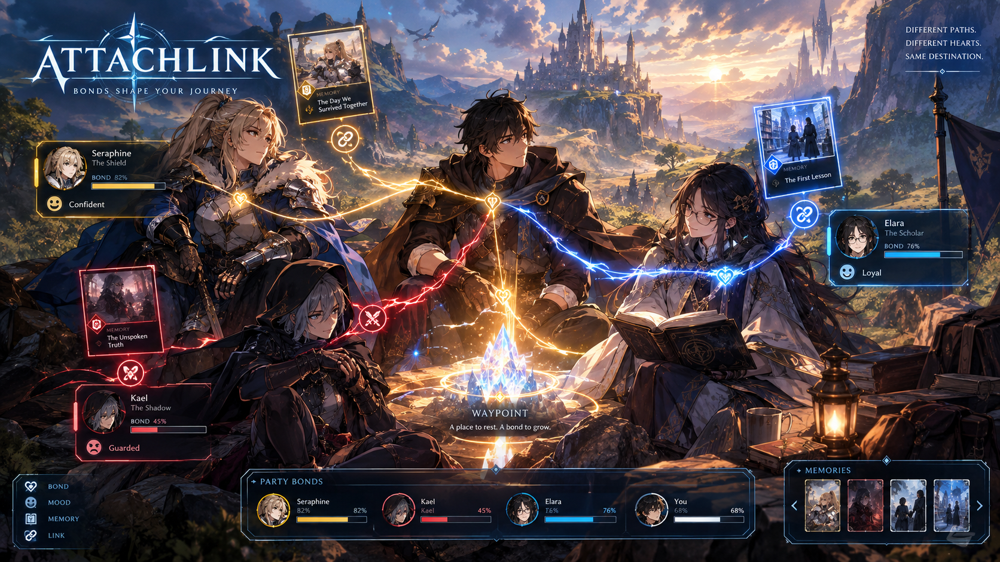

<p align="center">
  
</p>

# <p align="center">AttachLink 🔗</p>
### <p align="center"><i>Living NPC Minds, Dynamic Bonds, and Emotional Chemistry for AI Dungeon</i></p>

<p align="center">
  Made with ❤️ by <b>Neal (<a href="https://ko-fi.com/nealverse">Nealverse</a>)</b> · <a href="https://github.com/HackerMan998">HackerMan998</a>
</p>

<p align="center">
  <a href="https://ko-fi.com/nealverse"></a>
  <a href="https://play.aidungeon.com/profile?contentType=scenario&sort=updated"></a>
  <a href="LICENSE"></a>
</p>

<p align="center">
  <a href="#-overview">Overview</a> •
  <a href="#-how-it-works">How It Works</a> •
  <a href="#-what-it-looks-like-in-game">In-Game Cards</a> •
  <a href="#-relationship-tracks">Relationship Tracks</a> •
  <a href="#-in-game-commands">Commands</a> •
  <a href="#-quick-installation-guide">Installation</a> •
  <a href="#-creator-settings">Settings</a> •
  <a href="#-support--creator-scenarios">Support</a>
</p>

---

## 🌟 Overview

**AttachLink** is an advanced relationship, cognitive memory, and emotional chemistry engine designed specifically for **AI Dungeon**.

In default AI Dungeon, companions can easily forget what happened a few turns ago or act generic over long adventures. **AttachLink** gives your story's characters:
- **Their Own Private Minds:** Personal first-person impressions and shifting moods that react to your actions.
- **Hidden Agendas:** Secret desires and goals that steer how they treat you.
- **Dual-Track Progression:** Independent tracking for **Trust & Friendship** (Bond) and **Romantic Passion** (Romance).
- **Milestone Memories:** A growing timeline of shared memories preserved right on their Story Cards.

Whether you're exploring high-fantasy dungeons, surviving gritty sci-fi, or playing a cozy romance, your companions will truly feel alive.

---

## ⚡ How It Works

AttachLink works quietly behind the scenes without interrupting your narrative flow:

1. **Automatic Detection (Turn 0):** On the very first turn, it automatically reads your scenario's existing character story cards and opening text. Companions are tracked right from the start!
2. **The 15-Turn Pause Menu:** Every 15 turns (or whenever you type `/reflect`), the story temporarily pauses. The companion steps into their own mind, reflects on recent events, writes an authentic inner monologue, and updates their relationship stats.
3. **Intimacy & Combat Awareness:** Shared romance, physical intimacy, sex, or surviving life-or-death battles dynamically surge both Bond and Romance levels.
4. **Memory History Timeline:** Past reflections are saved to a chronological `[Memory History]` log on the companion's card.
5. **Zero Immersion Leaks:** Internal commands and thinking prompts are cleanly swallowed—they will never clutter your story text.

---

## 🖥️ What It Looks Like In-Game

AttachLink automatically creates and updates real AI Dungeon Story Cards:

### 1. Companion Relationship Card
Every companion has their own card with live visual meters:

```text
[Mia's AttachLink - Relationship Status]
• Mood: Devoted
• Bond: [───── │ ►►►►►] (+5) Inseparable (Soul-bound loyalty & unbreakable bond)
• Romance: [♥♥♥♥♥] (5/5) Eternal Soulmates (Bound by true, timeless love)

Secret Agenda: "Stay close to him and build a quiet life together after this quest."
Core Impression: "Being so close to him makes me feel truly safe. When he held my hand through the storm, I knew I never wanted to let go."

[Memory History]
• "He listened to me by the campfire when no one else would."
• "A bit reckless, but he kept his promise to protect my village."
```

### 2. Live System Console Card
A handy in-game dashboard story card showing active characters and turn countdowns:

```text
[AttachLink System Console]
Status: Active
Active Companion: Mia
Turn Progress: 8/15 turns until next automatic reflection pause

Tracked Companions:
• Mia: Bond +5 | Romance 5/5 (Devoted)
• Gary: Bond +2 | Romance 0/5 (Cordial)

Commands: /reflect, /reflect [Name], /track [Name], /status
```

---

## 📊 Relationship Tracks

AttachLink separates emotional friendship from romantic attraction so relationships develop naturally:

### 🤝 The Bond Track (-5 to +5)
*Measures friendship, loyalty, respect, and mutual trust:*

| Level | Visual Gauge | Standing | What It Means |
|:---:|:---:|:---|:---|
| **-5** | `[◄◄◄◄◄ │ ─────]` | **Sworn Nemesis** | Lethal hatred, mortal enmity, and vengeful hostility. |
| **-4** | `[◄◄◄◄─ │ ─────]` | **Bitter Foe** | Active animosity, malicious sabotage, and bitterness. |
| **-3** | `[◄◄◄── │ ─────]` | **Open Adversary** | Constant friction, open rivalry, and active defiance. |
| **-2** | `[◄◄─── │ ─────]` | **Unfriendly** | Cold dislike, social tension, and guarded irritation. |
| **-1** | `[◄──── │ ─────]` | **Distrustful** | Skeptical of your motives and guarded with personal info. |
| **0** | `[───── │ ─────]` | **Neutral** | Casual stranger or acquaintance; no strong feelings yet. |
| **+1** | `[───── │ ►────]` | **Cordial** | Polite warmth, friendly ease, and approachable demeanor. |
| **+2** | `[───── │ ►►───]` | **Companion** | Enjoyable company, helpful ally, and casual friend. |
| **+3** | `[───── │ ►►►──]` | **Reliable Friend** | Trustworthy partner, supportive confidant, and faithful ally. |
| **+4** | `[───── │ ►►►►─]` | **Close Confidant** | Deep emotional vulnerability, shared secrets, and fierce loyalty. |
| **+5** | `[───── │ ►►►►►]` | **Inseparable** | Unconditional devotion, soul-bound loyalty, and unbreakable bond. |

---

### 💖 The Romance Track (0 to 5)
*Measures romantic attraction, desire, emotional chemistry, and physical intimacy:*

| Stage | Hearts Gauge | Relationship | What It Means |
|:---:|:---:|:---|:---|
| **0/5** | `[♡♡♡♡♡]` | **Platonic** | No romantic feelings or physical attraction. Purely platonic. |
| **1/5** | `[♥♡♡♡♡]` | **Subtle Spark** | Passing butterflies, subtle blushing, and curious glances. |
| **2/5** | `[♥♥♡♡♡]` | **Mutual Crush** | Flustered attraction, playful teasing, and mutual romantic interest. |
| **3/5** | `[♥♥♥♡♡]` | **Lovers / Partners** | Open romantic affection, physical intimacy, and passionate dating. |
| **4/5** | `[♥♥♥♥♡]` | **Deep Devotion** | Intense love, physical and emotional commitment, and profound passion. |
| **5/5** | `[♥♥♥♥♥]` | **Eternal Soulmates** | Timeless, unbreakable love and total romantic devotion. |

---

## 💬 In-Game Commands

Simply type these commands into the player action box during gameplay. AttachLink swallows them immediately—**nothing leaks into the story**:

| Command | Example | Description |
|:---|:---|:---|
| **`/reflect`** | `/reflect` | Forces an immediate reflection pause for the active character in the current scene. |
| **`/reflect [Name]`** | `/reflect Mia` | Triggers an immediate reflection for a specific companion by name. |
| **`/track [Name]`** | `/track Vera` | Starts tracking an unlisted NPC and creates their companion card. |
| **`/status`** | `/status` | Displays the active character and turns remaining until the next automatic reflection. |

---

## 🚀 Quick Installation Guide

Setting up AttachLink takes **less than 2 minutes**:

### Step 1: Enable Scripting in AI Dungeon
1. Go to [AI Dungeon](https://play.aidungeon.com/) on PC (or Desktop view on mobile).
2. Edit your scenario and click the **Details** tab.
3. Scroll down to **Scripting**, toggle **Scripts Enabled** to **ON**, and click **Edit Scripts**.

---

### Step 2: Copy & Paste the 4 Tabs

Click each tab below to view and copy the code:

<details>
<summary><b>👉 Tab 1: Input (Click to expand)</b></summary>

Select the **Input** tab in AI Dungeon, delete any existing code, and paste:

```javascript
// AttachLink - Input Modifier
var modifier = (text) => {
  try {
    if (typeof AttachLink !== 'undefined') {
      AttachLink.init(state);

      // 1. Identify active character in the scene
      AttachLink.resolveActiveCharacter(state, history);

      var trimmed = text.trim();

      // Command: /track [Name] (e.g. /track Vera)
      var trackMatch = trimmed.match(/^\/track(?:\s+(.+))?$/i);
      if (trackMatch) {
        var targetName = trackMatch[1] ? trackMatch[1].trim() : "";
        if (!targetName) targetName = AttachLink.findProminentNameInScene(history);
        if (targetName) {
          var charData = AttachLink.ensureCharacter(targetName, state);
          var actualName = charData ? charData.name : targetName;
          state.attachLink.activeChar = actualName;
          AttachLink.syncStoryCard(state, actualName);
          AttachLink.syncSystemConsoleCard(state);
          state.attachLink.commandMessage = `Now tracking ${actualName}! A companion AttachLink card has been created.`;
        } else {
          state.attachLink.commandMessage = `Please specify a character to track, e.g. /track Vera`;
        }
        return { text: "" };
      }

      // Command: /status
      if (trimmed.match(/^\/status$/i)) {
        var turns = (state.attachLink && state.attachLink.turnsSinceReflection) || 0;
        var maxTurns = AttachLinkConfig.reflectionCooldown || 15;
        var remaining = Math.max(0, maxTurns - turns);
        var active = (state.attachLink && state.attachLink.activeChar) || "None";
        state.attachLink.commandMessage = `Status: Active NPC is "${active}". Turn ${turns}/${maxTurns} (${remaining} turns until automatic pause).`;
        AttachLink.syncSystemConsoleCard(state);
        return { text: "" };
      }

      // Command: /reflect [Optional Name] (e.g. /reflect or /reflect Vera)
      var reflectMatch = trimmed.match(/^\/reflect(?:\s+(.+))?$/i);
      if (reflectMatch) {
        var targetName = reflectMatch[1] ? reflectMatch[1].trim() : "";
        if (!targetName) {
          targetName = (state.attachLink && state.attachLink.activeChar) || AttachLink.findProminentNameInScene(history);
        }

        if (targetName) {
          var charData = AttachLink.ensureCharacter(targetName, state);
          var actualName = charData ? charData.name : targetName;
          state.attachLink.activeChar = actualName;
          state.attachLink.isReflecting = true;
          state.attachLink.reflectingCharacter = actualName;
          state.attachLink.turnsSinceReflection = AttachLinkConfig.reflectionCooldown;
          AttachLink.syncSystemConsoleCard(state);
          return { text: "" };
        } else {
          state.attachLink.commandMessage = `No active character detected in scene. Type '/reflect [Name]' (e.g. /reflect Vera) or create a Character Story Card.`;
          AttachLink.syncSystemConsoleCard(state);
          return { text: "" };
        }
      }

      // Normal turn: increment turn counter
      state.attachLink.turnsSinceReflection = (state.attachLink.turnsSinceReflection || 0) + 1;
      AttachLink.syncSystemConsoleCard(state);
    }
    return { text };
  } catch (err) {
    return { text };
  }
};

modifier(text);
```
</details>

<details>
<summary><b>👉 Tab 2: Context (Click to expand)</b></summary>

Select the **Context** tab in AI Dungeon, delete any existing code, and paste:

```javascript
// AttachLink - Context Modifier
var modifier = (text) => {
  try {
    // 1. Clean previous thought leaks from recent text
    let cleanedText = typeof AttachLink !== 'undefined' && AttachLink.cleanContextLeaks
      ? AttachLink.cleanContextLeaks(text)
      : text;

    if (typeof AttachLink === 'undefined') {
      return { text: cleanedText };
    }

    AttachLink.init(state);

    // 2. Identify active character or manual reflection target
    const activeChar = AttachLink.resolveActiveCharacter(state, history);
    const targetChar = (state.attachLink && state.attachLink.reflectingCharacter) || activeChar;

    let finalText = cleanedText;

    if (targetChar) {
      const charData = AttachLink.ensureCharacter(targetChar, state);
      const currentAction = (typeof info !== 'undefined' && info.actionCount) ? info.actionCount : 0;

      // Inject relationship & cognitive context into frontMemory
      const emotionalContext = AttachLink.getPromptContext(state);
      if (typeof state.memory === 'string') {
        if (!state.memory.includes("[AttachLink:")) {
          state.memory = emotionalContext + (state.memory ? "\n" + state.memory : "");
        }
      } else {
        state.memory = state.memory || {};
        state.memory.frontMemory = emotionalContext;
      }

      // 3. Check for automatic or manual pause menu reflection
      let taskPrompt = "";
      const isReflecting = state.attachLink && state.attachLink.isReflecting;
      const turns = (state.attachLink && state.attachLink.turnsSinceReflection) || 0;

      if (isReflecting || (currentAction > 0 && turns >= AttachLinkConfig.reflectionCooldown)) {
        state.attachLink.isReflecting = true;
        state.attachLink.reflectingCharacter = state.attachLink.reflectingCharacter || targetChar;
        taskPrompt = `\n\n[Task: STOP THE STORY & REFLECT. Step into the mind of ${targetChar} and reflect deeply on what just happened in the recent scene with the protagonist.
Write ${targetChar}'s authentic, unfiltered first-person internal monologue in quotes (what she is feeling, thinking about the protagonist, and desiring next).
Evaluate her updated relationship stats based on the scene:
• Physical intimacy / Sex / Romance: Increase Romance (+1 to +2) and Bond (+1 to +2). Mood: Passionate, Devoted, Loving, or Flustered.
• Teamwork / Friendship / Bonding: Increase Bond (+1 to +2). Mood: Warm, Cordial, or Cheerful.
• Conflict / Betrayal / Fear: Decrease Bond (-1 to -2). Mood: Guarded, Distrustful, or Hostile.
Format strictly as:
(${targetChar}'s AttachLink: "[1-3 sentences of genuine inner monologue reacting directly to the recent scene]" | Mood: [Emotion] | Agenda: [What she secretly desires or wants next] | Bond: [+/-1 to +/-3] | Romance: [+/-1 to +/-3])
Rules:
• Do NOT copy bracket placeholders. Write genuine thoughts for ${targetChar}.
• Do NOT continue the story or write dialogue.]\n`;
      }

      if (taskPrompt) {
        // Ensure prompt fits within model context budget before appending
        const fittedBase = AttachLink.fitContext(cleanedText, taskPrompt.length);
        finalText = fittedBase + taskPrompt;
      }
    }

    return { text: finalText };
  } catch (err) {
    return { text };
  }
};

modifier(text);
```
</details>

<details>
<summary><b>👉 Tab 3: Output (Click to expand)</b></summary>

Select the **Output** tab in AI Dungeon, delete any existing code, and paste:

```javascript
// AttachLink - Output Modifier
var modifier = (text) => {
  try {
    let cleanedText = text;

    if (typeof AttachLink === 'undefined') {
      return { text: cleanedText };
    }

    // 1. Handle Command Messages (e.g. /status, /track, or notices)
    if (state.attachLink && state.attachLink.commandMessage) {
      cleanedText = `\n\n>>> 💡 [AttachLink System] ${state.attachLink.commandMessage} Please press continue to resume. <<<\n`;
      delete state.attachLink.commandMessage;
      if (state.attachLink && state.attachLink.characters) {
        for (var cName of Object.keys(state.attachLink.characters)) {
          AttachLink.syncStoryCard(state, cName);
        }
      }
      AttachLink.syncSystemConsoleCard(state);
      return { text: cleanedText };
    }

    // 2. Handle Automatic or Manual Pause Menu (Reflection Turn)
    if (state.attachLink && state.attachLink.isReflecting) {
      const charName = state.attachLink.reflectingCharacter || state.attachLink.activeChar;
      
      const parsed = AttachLink.parseReflection(cleanedText, charName, (typeof history !== 'undefined' ? history : []));

      if (parsed && (parsed.thought || parsed.bond !== undefined || parsed.mood)) {
        const charData = AttachLink.ensureCharacter(charName, state);
        if (parsed.thought && parsed.thought.length >= 4) {
          if (charData.coreMemory && charData.coreMemory !== parsed.thought && !/deep thoughts|thoughts about the protagonist/i.test(charData.coreMemory)) {
            charData.thoughts = charData.thoughts || [];
            if (!charData.thoughts.includes(charData.coreMemory)) {
              charData.thoughts.unshift(charData.coreMemory);
              if (charData.thoughts.length > 5) charData.thoughts.pop();
            }
          }
          charData.coreMemory = parsed.thought;
        }
        if (parsed.agenda && parsed.agenda.length >= 3) {
          charData.agenda = parsed.agenda;
        }
        AttachLink.applyDeltas(state, charName, {
          mood: parsed.mood,
          bond: parsed.bond,
          isAbsoluteBond: parsed.isAbsoluteBond,
          romance: parsed.romance,
          isAbsoluteRomance: parsed.isAbsoluteRomance
        });
      }

      // Reset reflection state
      state.attachLink.turnsSinceReflection = 0;
      state.attachLink.isReflecting = false;
      state.attachLink.reflectingCharacter = null;
      
      // Override output with pause message
      cleanedText = `\n\n>>> 🧠 [AttachLink Update] ${charName || "The characters are"} reflecting on your actions... Relationship updated! Please press continue to resume the story. <<<\n`;
    }

    // Secondary leak cleaner pass to guarantee zero immersion breaks
    cleanedText = AttachLink.cleanContextLeaks(cleanedText);

    // Sync updated Story Cards for all tracked characters
    if (state.attachLink && state.attachLink.characters) {
      for (var cName of Object.keys(state.attachLink.characters)) {
        AttachLink.syncStoryCard(state, cName);
      }
    }

    // Always update the live System Console Story Card!
    AttachLink.syncSystemConsoleCard(state);

    return { text: cleanedText };
  } catch (err) {
    return { text };
  }
};

modifier(text);
```
</details>

<details>
<summary><b>👉 Tab 4: Library (Click to view instructions)</b></summary>

Select the **Library** tab in AI Dungeon, delete any existing code, and paste the full script from [`src/library.js`](./src/library.js).

> **Note:** Because `library.js` contains the complete engine (character discovery, card generators, state management, and memory history), you can open and copy it directly from:  
> 🔗 **[`src/library.js`](./src/library.js)**
</details>

Finally, click the yellow **SAVE** button in the top right corner of the AI Dungeon script editor!

---

## ⚙️ Creator Settings

If you are a scenario creator, you can easily customize AttachLink at the very top of [`src/library.js`](./src/library.js):

```javascript
var AttachLinkConfig = {
  // 1. Manually track specific NPC names (e.g. ["Marie", "Claire"])
  MANUAL_CHARACTERS: [""],

  // 2. Strict NPC Filtering
  // Keep false (recommended) so only real NPCs with Character Story Cards receive companion cards.
  // This completely prevents common words like "Her", "And", "Pacific" from turning into cards!
  autoDiscoverUnlistedNPCs: false,

  // 3. Automation Settings
  autoDetectFromStoryCards: true,             // Tracks pre-existing NPCs immediately on Turn 0
  autoGenerateStoryCardsForExistingNPCs: true, // Auto-generates AttachLink companion cards
  reflectionCooldown: 15,                     // Turns between automatic pause-and-reflect cycles
  lookbackTurnsForPresence: 5                 // Number of recent turns inspected for NPC presence
};
```

---

## 💡 Gameplay & Immersion Tips

- 🖥️ **Check the System Console:** Open your `AttachLink System Console` story card anytime to see turn progress and current standing with all party members.
- 🤝 **Build Real Trust:** Working together, keeping promises, and defending companions advances **Bond**.
- 💖 **Physical Intimacy & Romance:** Flirting, passionate dates, and sexual intimacy naturally surge **Romance**, unlocking deeper devotion and updating their core thoughts.
- 🧠 **Living Responses:** Companions genuinely remember their impressions—the AI reads their `Core Impression` in the background, subtly steering how they speak and act.
- 📜 **Look Back at History:** Check companion cards periodically to read their `[Memory History]` timeline of how your relationship developed over time!

---

## ☕ Support & Creator Scenarios

If AttachLink brings your AI Dungeon adventures to life and you'd like to support continued updates (or help me and my family stay afloat with essentials and bank loans), please consider dropping a tip on Ko-fi! Every bit of support means the world to me and helps keep projects like AttachLink completely free, open-source, and actively maintained.

<p align="center">
  <a href="https://ko-fi.com/nealverse" target="_blank">
    
  </a>
  <br>
  👉 <a href="https://ko-fi.com/nealverse"><b>ko-fi.com/nealverse</b></a>
</p>

### 🎮 Play My AI Dungeon Scenarios
Looking for interactive adventures to test AttachLink in? Explore my playable scenarios on AI Dungeon:  
👉 **[Nealverse's AI Dungeon Profile & Scenarios](https://play.aidungeon.com/profile?contentType=scenario&sort=updated)**

---

## 📜 License & Open Source Permissions

AttachLink is free, open-source, and dedicated to the public domain under the **[Creative Commons CC0 1.0 Universal (CC0 1.0) Public Domain Dedication](LICENSE)**.

You have complete worldwide freedom to:
- **Use & Play:** Embed AttachLink into any of your personal or publicly published scenarios.
- **Modify & Adapt:** Customize stats, tweak relationship formulas, or rewrite reflection prompts.
- **Distribute & Share:** Share scenarios, scripts, or derivative works anywhere without restrictions.
- **No Legal Strings Attached:** Attribution is not legally required, though crediting **AttachLink by Nealverse** or tipping on [Ko-fi](https://ko-fi.com/nealverse) is warmly appreciated! ❤️

---

<p align="center"><b>AttachLink v4.3</b> · Built for AI Dungeon with passion and care.</p>
